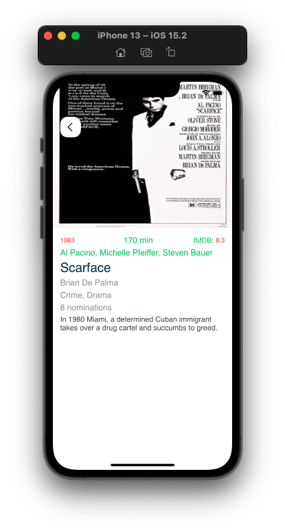

# Movie App with OMDb API

This app lists movies using omdb api. Remote config is made with firebase in the application. And push notification settings are made. Firebase Analytics, the details of the movie are analyzed, and the name of the movie is sent to firebase and saved. Lottie was used for animations in the application.

### APP Movie

### Tools 
- Firebase 
    - Remote Config
    - Analytics
    - Push Notification (Cloud Messaging)
- MVVM
- Network Manager
- Service Manager
- Delegation Pattern
- Closures
- Swift-Storyboard
- UI
  - TableView and Custom Cell
  - ScrollView
  - AnimationView with Lottie

### Packages
- Swift Package Manager
  - [Firebase](https://github.com/firebase/firebase-ios-sdk)
  - [Lottie](https://github.com/airbnb/lottie-ios)
  - [Alamofire](https://github.com/Alamofire/Alamofire.git)
  - [Kingfisher](https://github.com/onevcat/Kingfisher.git)
  - [Reachability.swift](https://github.com/ashleymills/Reachability.swift)

### API
- [OMDb API](http://omdbapi.com/) 

### App Icon

### App Launch Screen

### Splash Screen

##### Firebase Push Notification Configure

##### Network Control & Firebase Remote Config Fetch Text

 

##### Route to Home Screen & Animated Transition .flip

### Home Screen

    
    

##### Search

    
    
    

##### Firebase Analytics & When the movie detail page open

